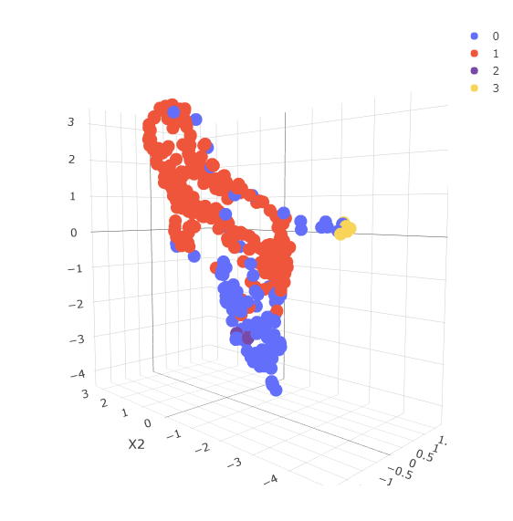

# Quantitative Regional Economics seminar

This project was developed for the **QRE** seminar. The objective was to develop a Spatial Econometric Model and analyze the relationship between some regressors and the outcome. A Spatial Durbin Model (SDM) was estimated to evaluate the direct and indirect relationships, and this it used GDP as the outcome and some regressors such as physical investment, employment rate, IT employee rate, and some control variables.

In addition, a *Clustering Analysis* was applied to discover additional patterns using the previous features, and the results were presented in the project. The DBSCAN (Density Based Spatial Clustering Analysis) algorithm was used to perform this analysis, which allowed the discovery of 4 clusters.

## Model Results

-------------------------------------
## Clustering Analysis

-------------------------------------
